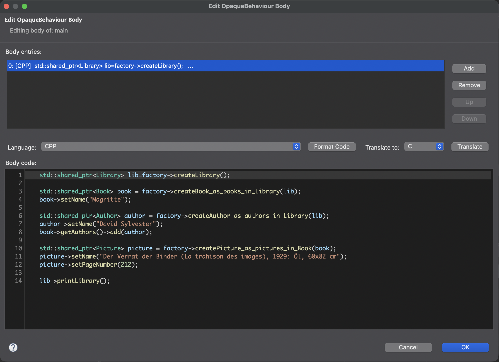
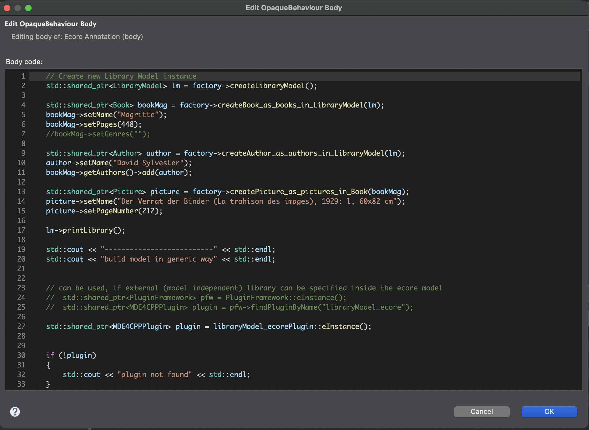

# Opaque Behaviour Editor


A specialized Eclipse Plugin designed to provide a rich, intelligent editing experience for UML `OpaqueBehavior` bodies and Ecore model annotations. It is particularly well-suited for developers writing C++ behaviors intended for the **MDE4CPP** (Model-Driven Engineering for C++) code generation framework.

Instead of relying on basic, unformatted text boxes for defining model behaviors, this plugin injects a fully-featured, context-aware code editor directly into the Eclipse IDE.





## ✨ Key Features

### 🧠 Context-Aware Code Completion (`Ctrl+Space`)

- Intelligently queries the underlying UML/Ecore model using a `ModelDictionary`.
- Suggests properties, operations, and variables that actually exist in your model's context.

### 📝 Advanced Snippet Engine & Linked Mode

- Ships with built-in code templates (e.g., `create`, `for`, `cast`).
- Features full **Eclipse LinkedModeUI** support: When a snippet is expanded, use `TAB` to instantly jump between variable placeholders.
- **Variable Mirroring**: Typing into a placeholder automatically updates all matching placeholders in real-time.
- **Fully Customizable**: Snippets are externalized. You can add, edit, or disable snippets by modifying `~/.opaque_snippets.properties` in your home directory.

### 🎨 Semantic Syntax Highlighting & Editor Features

- Custom, real-time syntax highlighter that goes beyond basic keywords.
- Visually distinguishes between Standard Types (e.g., `std::shared_ptr`), UML Model Types, Variables, Methods, Strings, and Comments.
- **Find and Replace**: Integrated search dialog with full highlighting support for "Find All" matches across the code block.
- **Line Numbers**: Displays a dedicated line number ruler in the editor margin for easy code navigation.
- **Bracket Matching**: Highlights corresponding opening and closing brackets (`()`, `{}`, `[]`) to help you easily track nested code scopes.
- **Current Line Highlighting**: Subtly highlights the active line your cursor is on for improved focus.
- **Rename Symbol**: Intelligently find and rename all occurrences of a variable within the behavior body (F2 or Ctrl+R).
- Fully compatible with both Eclipse Light and Dark themes.

### 🪄 Smart Pointers & Typing Assists

- **C++ Smart Pointers**: If you type `.` on a variable that the editor resolves as a C++ pointer type, it automatically transforms the keystroke into `->` to save you time.

### 🔄 Multi-Language Support & Translation

- Natively supports **C++** and **Java** language definitions, easily toggleable via a dropdown menu.
- Built-in **Auto-Formatting** to keep your code clean and aligned.
- Experimental **Code Translation**: A translation button to attempt converting behavioral code from one language to another.

### 🛡️ Real-Time Model Validation & Markers

- Validates the written code against the model dictionary to ensure you aren't referencing properties or types that do not exist in the UML scope.
- **Error Markers** appear directly in the editor gutter when validation fails or syntax errors are detected.

### 💬 Rich Tooltips & Hovers

- Hovering over a validation error marker provides quick diagnostic information.
- Hovering over variables and types displays rich semantic tooltips outlining their underlying model metadata.

### 🔗 Hyperlink Navigation

- Hold `Ctrl` (or `Cmd` on Mac) and hover over model variables and methods to turn them into clickable hyperlinks.
- Clicking a hyperlinked element will automatically select and navigate to the corresponding entity directly within the Eclipse Model Explorer!

## ⌨️ Keyboard Shortcuts

- `Ctrl + Space` (`Cmd + Space`): Trigger context-aware auto-completion and snippets.
- `Ctrl + Z` (`Cmd + Z`): Undo the last change.
- `Ctrl + Y` or `Ctrl + Shift + Z` (`Cmd + Shift + Z`): Redo the last undone change.
- `Ctrl + F` (`Cmd + F`): Open the Find and Replace dialog.
- `F2` or `Ctrl + R` (`Cmd + R`): Rename the symbol under the cursor.
- `Ctrl + Shift + F` (`Cmd + Shift + F`): Auto-format the current document.
- `Ctrl + /` (`Cmd + /`): Toggle line comments for the selected block.
- `Ctrl + D` (`Cmd + D`): Delete the current line.
- `Ctrl + Alt + Down` (`Cmd + Option + Down`): Duplicate the current line.
- `Ctrl + L` (`Cmd + L`): Go to a specific line number.
- `Ctrl + =` or `Ctrl + +` (`Cmd + =`): Zoom in editor text.
- `Ctrl + -` (`Cmd + -`): Zoom out editor text.
- `Alt + Z` (`Option + Z`): Toggle word wrap.
- `Ctrl + S` (`Cmd + S`): Quickly save the currently edited OpaqueBehaviour body.
- `Ctrl + Click` (`Cmd + Click`): Navigate to the underlying model element for the hovered variable/method.
- `TAB`: Instantly jump between variable placeholders when a code snippet is expanded.

## ⚙️ Customizing Snippets

To add your own custom snippets with multiple placeholders, modify the `~/.opaque_snippets.properties` file (generated on first run):

```properties
multi.label=myMultiPlaceholder (Snippet)
multi.template=std::shared_ptr<${Type1}> ${item} = factory->create${Type1}(${Type2});
```

_Note: Use the `${VariableName}` syntax to define placeholders. The editor will automatically handle the TAB-jumping and mirroring!_
